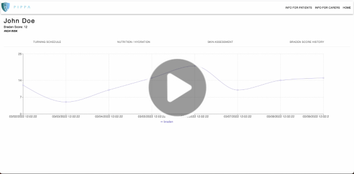

# Pressure Injury Prevention Personal App (Pippa)

Application created for Hackathon in colloboration with UofC's Faculty of Nursing.

Deployed version of the application can be found: https://pippa-application.herokuapp.com

Login: admin, Password: password

# About

App for scheduling the lying positions of bed ridden patients in long term care. Patients confined to their beds often develop pressure ulcers. To prevent this, it’s important to have a schedule that keeps track of how long a patient spent in which position. The schedule could be based on skin assessments made by healthcare professionals.  As such, PIPPA, is a personal assistant application that helps patients and healthcare workers collaborate using evidence based personalized pressure injury prevention techniques. 

The app aims to have an intuitive and easy to use interface while conveying the necessary information that either a healthcare aide or patient would need to reduce the risk of pressure injuries. Features incldue user login and authentication, an interactive patient catalog, patient repositioning scheduler, nutrition, hydration, and skin assessment logging/tracking with real time data visualizations of a patients’ historical Braden Scale readings.  Furthermore, there are links to resources for healthcare aides and patients, to discover knowledge on best practices related to pressure injury prevention.  

# Technical Information

App built with the following:
- JavaScript
- React (MaterialUI, Recharts)
- Java
- Spring Boot
- AWS Lightsail
- Heroku

# Demo

# Contributors
- Brandon Attai
- Tahsin Chowdhury
- Kelten Falez
- Behanz Sheikhi
- Daud Sheikh